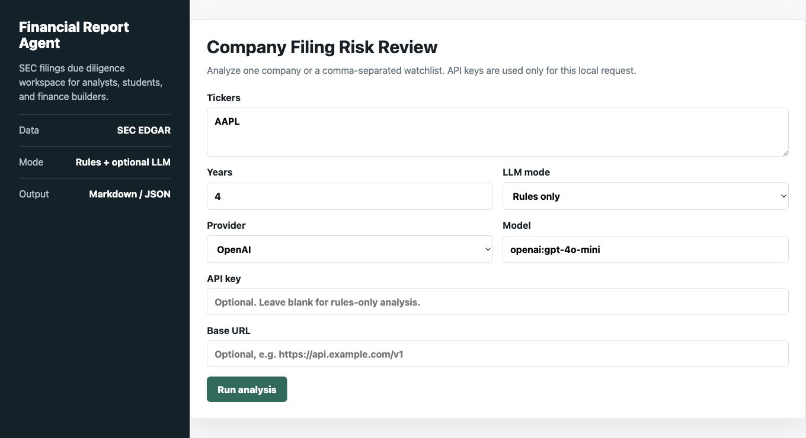
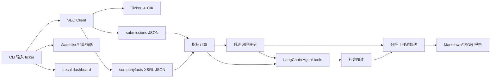

# Financial Report Agent


Financial Report Agent 是一个本地 SEC filing risk review workspace：输入美股 ticker 或 watchlist，自动抓取 SEC EDGAR 官方财报数据，解析 XBRL company facts，计算关键财务指标，生成可审计的风险观察报告。它适合投研、尽调、金融数据分析和 AI Agent 岗位展示。

- **规则模式**：不需要 LLM key，直接生成 Markdown/JSON 报告。
- **LangChain Agent 模式**：接入 OpenAI、DeepSeek 或 OpenAI-compatible API key 后，用 tool-calling agent 读取结构化财报事实和规则风险结果，再生成补充解读。

> 该项目只做财报事实分析和风险观察，不构成投资建议。

## 为什么这个项目有产品价值

- **节省初筛时间**：把 ticker 到 10-K/XBRL 指标/风险 memo 的流程自动化，适合分析师、咨询顾问和金融学习者。
- **可审计**：财务事实来自 SEC，LLM 只读取工具结果做解释，不直接编数字。
- **可私有部署**：本地 CLI + dashboard，用户自带 API key，不把 key 写入报告或仓库。
- **可扩展成付费工具**：后续可以加 peer comparison、MD&A/Risk Factors RAG、团队 watchlist、PDF export 和行业模板。

## 功能

- Ticker -> CIK 自动映射。
- 拉取 SEC submissions 与 XBRL companyfacts JSON。
- 本地缓存 SEC 响应，减少重复请求。
- 指标计算：收入同比、毛利率、经营利润率、净利率、负债/资产、流动比率、经营现金流/净利润、自由现金流、FCF margin、R&D intensity。
- 风险评估：收入下滑、盈利偏弱、杠杆偏高、流动性压力、现金流质量、自由现金流、数据完整性。
- 输出 `reports/*.md` 和 `reports/*.json`。
- 可选 LangChain Agent：工具调用财报快照和规则风险，生成中文补充分析。
- 支持用户自带 OpenAI、DeepSeek 或 OpenAI-compatible API key；真实 key 只放本地 `.env` 或系统环境变量。

## Demo

- 示例报告：[examples/AAPL_2025_financial_report.md](examples/AAPL_2025_financial_report.md)
- 本地 Web dashboard：`financial-report-dashboard --port 8765`



## 数据源

- SEC EDGAR API documentation: https://www.sec.gov/search-filings/edgar-application-programming-interfaces
- SEC data API host: https://data.sec.gov/
- Ticker mapping: `https://www.sec.gov/files/company_tickers.json`
- Submissions: `https://data.sec.gov/submissions/CIK##########.json`
- Company facts: `https://data.sec.gov/api/xbrl/companyfacts/CIK##########.json`

SEC 自动访问需要合理的 `User-Agent`。运行前建议把 `.env.example` 复制成 `.env` 并填入自己的项目名和邮箱。

## 快速开始

```bash
git clone https://github.com/clavelinaswykoniki-cell/financial-report-agent.git
cd financial-report-agent
python3 -m venv .venv
source .venv/bin/activate
python3 -m pip install -e ".[dev,llm]"
cp .env.example .env
```

编辑 `.env`：

```bash
SEC_USER_AGENT="financial-report-agent/0.1 your-name your-email@example.com"
OPENAI_API_KEY=""
FIN_AGENT_MODEL="openai:gpt-4o-mini"
```

无 LLM key 也能运行：

```bash
python3 -m financial_report_agent --ticker AAPL --llm off
```

批量筛选 watchlist：

```bash
financial-report-agent --ticker AAPL --watchlist MSFT,NVDA,GOOGL --llm off
```

启动本地 dashboard：

```bash
financial-report-dashboard --host 127.0.0.1 --port 8765
```

如果端口已被占用，换一个端口即可：

```bash
financial-report-dashboard --host 127.0.0.1 --port 8766
```

有 OpenAI key 时启用 LangChain Agent：

```bash
python3 -m pip install -e ".[llm]"
python3 -m financial_report_agent --ticker MSFT --llm on
```

DeepSeek 或其他 OpenAI-compatible API 也能接：

```bash
DEEPSEEK_API_KEY="sk-..."
FIN_AGENT_MODEL="deepseek:deepseek-chat"

# 或者
FIN_AGENT_API_KEY="sk-..."
FIN_AGENT_BASE_URL="https://api.example.com/v1"
FIN_AGENT_MODEL="openai-compatible:your-model"
```

输出示例：

```text
reports/AAPL_2025_financial_report.md
reports/AAPL_2025_financial_report.json
```

## 架构



## 项目目录

```text
src/financial_report_agent/
  sec_client.py   # SEC EDGAR API client + cache
  service.py      # 复用业务层
  metrics.py      # XBRL 标签 fallback、指标计算、风险评分
  report.py       # Markdown/JSON 报告输出
  workflow.py     # 分析工作流轨迹
  screening.py    # watchlist 批量筛选
  agent.py        # 可选 LangChain Agent
  cli.py          # 命令行入口
  dashboard.py    # 本地 Web dashboard
tests/
  test_metrics.py
  test_dashboard.py
```

## 用 Codex 从零复现的步骤

1. 先让 Codex 明确 MVP 边界：`做一个本地 CLI 财报 Agent，输入 ticker，抓 SEC EDGAR，生成 Markdown/JSON 报告；没有 key 也要能跑，有 key 再接 LangChain Agent。`
2. 让 Codex 读取当前目录和项目约束，不要直接全网乱抄框架。
3. 让 Codex 查官方资料：SEC EDGAR API、LangChain agents/tools 文档。
4. 让 Codex 设计模块：`sec_client / metrics / report / agent / cli / tests`。
5. 让 Codex 先实现不依赖 LLM 的确定性 pipeline，保证可测试、可复现。
6. 再让 Codex 接 LangChain：把结构化财报快照和规则风险封装成 tools，并通过 `.env` 或 dashboard 表单接入 OpenAI、DeepSeek 或 OpenAI-compatible API key，让模型只做解释和归纳。
7. 让 Codex 跑测试和真实 ticker 样例，如 `AAPL` 或 `MSFT`。
8. 让 Codex 写 README、架构图、简历 bullet，并标出局限：非投资建议、XBRL 标签差异、行业适配限制。

## 简历写法

- 基于 LangChain 与 SEC EDGAR 官方 API 构建财报分析 Agent，实现 ticker/CIK 查询、10-K/20-F 财报数据抓取、XBRL facts 解析与本地缓存。
- 设计财务指标与风险评分模块，覆盖增长、盈利能力、流动性、杠杆、现金流质量，并处理 taxonomy fallback、单位归一和期间对齐。
- 生成带数据质量提示和风险观察的 Markdown/JSON 财报分析报告，并提供本地 dashboard 与 watchlist 批量筛选；无 LLM key 可运行规则模式，有 key 可启用 LangChain tool-calling 补充解读。

## 补充文档

详见 [docs/github_project_selection.md](docs/github_project_selection.md)、[docs/codex_build_guide.md](docs/codex_build_guide.md)、[docs/api_key_setup.md](docs/api_key_setup.md)、[docs/release_checklist.md](docs/release_checklist.md) 和 [SECURITY.md](SECURITY.md)。

## 局限

- 当前 MVP 优先适配美国上市公司和 US-GAAP XBRL，银行、保险、REIT、能源公司需要行业特化指标。
- SEC XBRL companyfacts 只聚合非自定义 taxonomy 且适用于整个 filing entity 的 facts，部分公司自定义标签可能缺失。
- 风险评分是规则启发式，不代表审计意见、评级、估值或交易建议。
